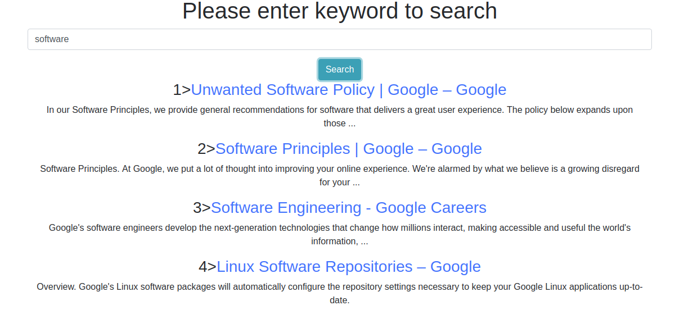

# Google Custom Search

Search for any keyword using Gem- https://github.com/wiseleyb/google_custom_search_api and got google search results

* Google Custom Search GEM - https://github.com/wiseleyb/google_custom_search_api

## Prerequisites:
You will need the following things properly installed on your computer.
* ruby -v 2.5.0
* rails -v 5.2.3

## Configuration
See [config/application.example.yml](https://github.com/rorong/google_custom_search/blob/master/config/application.example.yml).
The required settings are `google_api_key` and `google_search_cx`.

## Installation:
* git clone <repository-url>
* cd <repository>
* bundle install
* cp config/application.example.yml config/application.yml
* cp config/database.example.yml config/database.yml
* rails db:setup && rails db:seed

Running / Development:
* rails s
